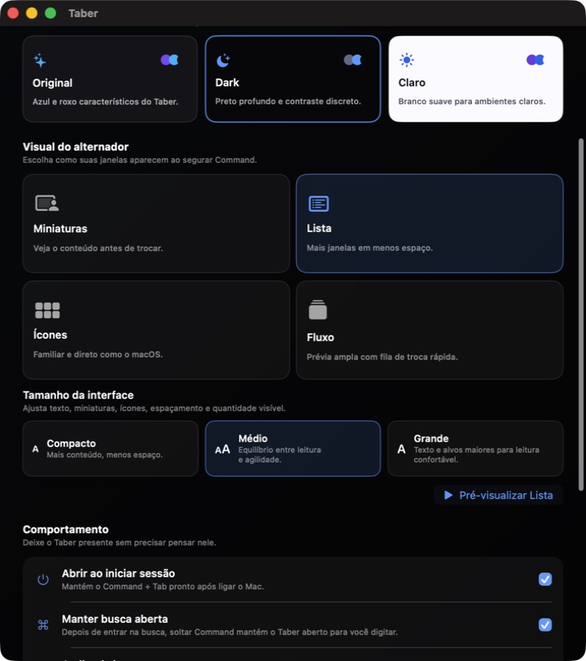
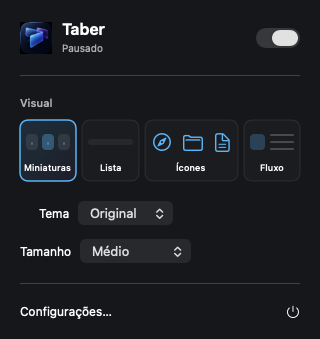
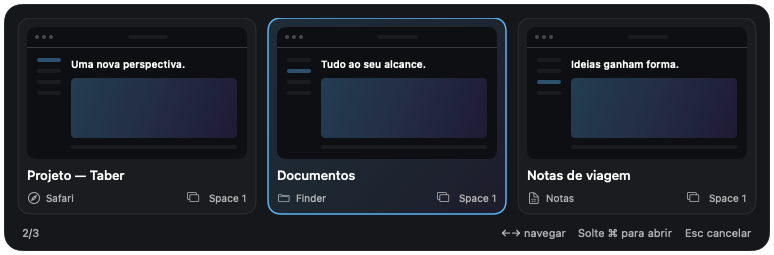
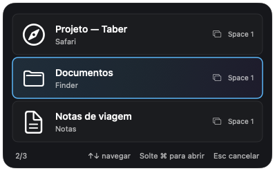
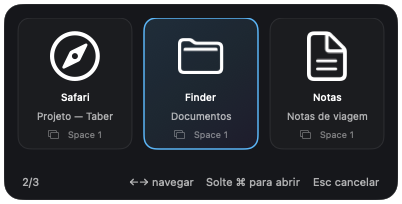
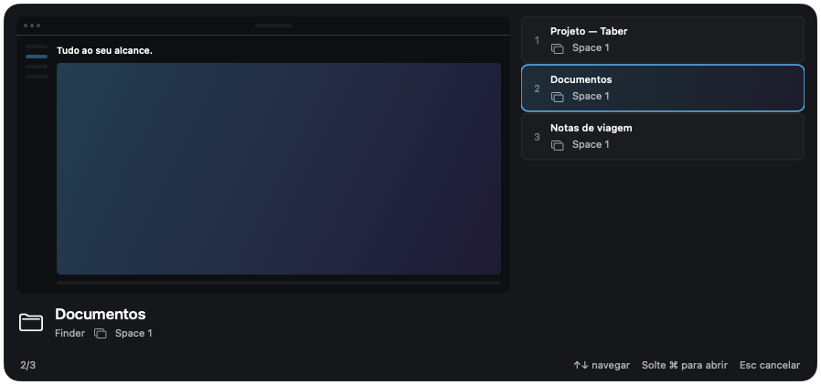

<p align="center">
  
</p>

<h1 align="center">Taber</h1>

<p align="center">
  <strong>Seu Mac, janela por janela.</strong><br>
  Command + Tab como sempre deveria ter sido.
</p>

Taber é um alternador de janelas para macOS que intercepta `Command + Tab` e permite navegar por cada janela aberta — inclusive janelas minimizadas, em tela cheia do macOS e em outros Spaces. Ele roda discretamente na barra de menus e processa tudo localmente.

## Destaques

- Alterna entre janelas individuais, não apenas entre aplicativos.
- Mantém várias janelas do Finder, Safari, Chrome e outros apps como opções distintas.
- Inclui janelas minimizadas, em outros Spaces e em tela cheia do macOS.
- Identifica o Space de cada janela (`Space 1`, `Space 2` e assim por diante).
- Exclui agentes em segundo plano, helpers, Spotlight e superfícies técnicas.
- Oferece busca instantânea por nome do aplicativo ou título da janela.
- Exibe miniaturas locais quando a permissão de Gravação de Tela está ativa.
- Permite três tamanhos de interface e três temas.
- Pode iniciar automaticamente com a sessão do macOS.

## Aparências

| Visual | Navegação | Uso ideal |
| --- | --- | --- |
| **Miniaturas** | `←` e `→` | Reconhecer a janela pelo conteúdo antes de trocar. |
| **Lista** | `↑` e `↓` | Ver muitas janelas com título, aplicativo e Space. |
| **Ícones** | `←` e `→` | Uma experiência familiar e direta, próxima ao macOS. |
| **Fluxo** | `↑` e `↓` | Combinar uma prévia ampla com uma fila rápida de janelas. |

O painel se adapta automaticamente à quantidade de janelas. Os tamanhos **Compacto**, **Médio** e **Grande** ajustam texto, ícones, miniaturas, espaçamento e quantidade visível. Os temas disponíveis são **Original**, **Dark** e **Claro**.

<p align="center">
  
</p>

## Como usar

1. Pressione `Command + Tab` para abrir o Taber e avançar.
2. Continue segurando `Command` e pressione `Tab` novamente para percorrer as janelas.
3. Use `Shift + Command + Tab` para voltar.
4. Use as setas indicadas pelo visual escolhido para navegar diretamente.
5. Solte `Command` para ativar a janela selecionada.
6. Pressione `Esc` para cancelar.

Com o alternador aberto, pressione `Shift` duas vezes para pesquisar. Esse atalho pode ser alterado para `Espaço` ou `F` nas configurações. Quando **Manter busca aberta** está ativo, você pode soltar `Command`, continuar digitando e confirmar com `Return`.

As configurações ficam acessíveis pelo ícone do Taber na barra de menus. `Command + W` fecha somente essa janela e mantém o aplicativo em segundo plano; `Command + Q` encerra o Taber por completo.

Um clique no ícone abre o painel rápido de visual, tema e tamanho. O clique
direito mantém um menu nativo. Nas configurações, a sidebar separa **Aparência**,
**Comportamento**, **Atalhos e busca** e **Permissões e sobre** e lembra a última
seção visitada. `Command + ,` abre as configurações.

### Interface refinada

As prévias abaixo usam conteúdo fictício. Materiais discretos, seleção com
contorno e tipografia de sistema mantêm o foco nas suas janelas.







Consulte a [linguagem visual e validação](Docs/Design.md).

## Requisitos

- macOS 14 Sonoma ou mais recente.
- Xcode 16 ou mais recente para compilar o projeto.
- Uma equipe de assinatura selecionada no Xcode. Um **Personal Team** é suficiente para uso local.
- Permissão de **Acessibilidade** para interceptar o atalho e focar janelas.
- Permissão de **Gravação de Tela** para mostrar miniaturas.

## Instalação pelo Xcode

1. Abra `Taber.xcodeproj`.
2. Selecione o target **Taber** e abra **Signing & Capabilities**.
3. Escolha sua equipe em **Team** e mantenha **Automatically manage signing** ativo.
4. Execute `Product > Run` para desenvolvimento.

Para que as permissões do macOS permaneçam estáveis no uso diário, gere e instale a versão assinada em `/Applications`:

```bash
zsh Scripts/build-app.sh
zsh Scripts/install-app.sh
```

O primeiro script cria `Build/Taber.zip`, valida a assinatura e mantém os artefatos temporários fora do iCloud Drive. O segundo instala o app em `/Applications/Taber.app` e o abre.

Na primeira execução:

1. Abra **Ajustes do Sistema > Privacidade e Segurança > Acessibilidade**.
2. Ative somente o `Taber.app` instalado em `/Applications`.
3. Ative o Taber em **Gravação de Tela** para habilitar as prévias.
4. Encerre e abra o Taber novamente após conceder as permissões.

Uma entrada antiga com ícone de Terminal pertence ao executável Swift Package legado e pode ser removida. A arquitetura atual usa somente o aplicativo macOS assinado.

## Desenvolvimento e validação

Execute **zsh Scripts/test.sh** para rodar regressões, lógica e interface no
Xcode. Use **--logic-only** para não automatizar a interface. Consulte a
[matriz de cenários e limites de validação](Docs/TestMatrix.md).

Build de verificação sem assinatura:

```bash
xcodebuild \
  -project Taber.xcodeproj \
  -scheme Taber \
  -configuration Debug \
  -derivedDataPath /tmp/TaberDerivedData \
  CODE_SIGNING_ALLOWED=NO \
  build
```

Testes de regressão das regras puras de janelas:

```bash
xcrun swiftc \
  Sources/Taber/Services/WindowMatchingPolicy.swift \
  Scripts/RegressionChecks/main.swift \
  -o /tmp/taber-regression-checks
/tmp/taber-regression-checks
```

Inspeção da política contra as janelas abertas no Mac:

```bash
xcrun swiftc \
  Sources/Taber/Services/WindowEligibilityPolicy.swift \
  Scripts/WindowEligibilityCheck/main.swift \
  -o /tmp/taber-window-check
/tmp/taber-window-check
```

## Arquitetura

- `GlobalShortcutMonitor`: captura global com `CGEventTap` e máquina de estado do atalho.
- `WindowManager`: enumeração, normalização, ordenação e cache dos metadados de janelas.
- `WindowEligibilityPolicy`: filtra agentes, helpers, shell do macOS e superfícies técnicas.
- `WindowMatchingPolicy`: reconcilia WindowServer e Accessibility sem duplicar janelas.
- `AccessibilityService`: restaura, eleva e focaliza a janela selecionada.
- `SpaceResolver`: identifica o Space associado a cada janela.
- `WindowThumbnailService`: captura assíncrona e cache limitado de miniaturas.
- `SwitcherPanelController`: mantém um único painel reutilizável para todos os visuais.
- `SettingsStore`: preferências observáveis e persistentes.

## Privacidade

O Taber não envia títulos, imagens ou conteúdo das janelas para nenhum serviço. A enumeração, a busca e as miniaturas são processadas no próprio Mac.

## Versionamento

Este repositório começou no estado consolidado do **Taber 1.0.1 (build 3)**. A versão atual é **Taber 1.1.0 (build 7)**. Como não existia um repositório Git antes do primeiro marco, versões intermediárias anteriores não foram recriadas artificialmente. Os commits seguem [Conventional Commits](https://www.conventionalcommits.org/), por exemplo `feat:`, `fix:`, `perf:`, `docs:` e `chore:`.

Consulte as [correções, testes, desempenho e limites de validação da 1.1.0](Docs/Release-1.1.0.md).

O código é privado e ainda não possui licença de distribuição pública.
